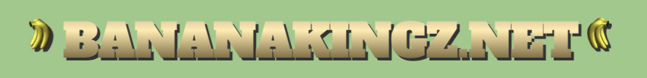

# 🍌 BANANAKINGZ.net 🍌



[](https://app.netlify.com/sites/bananakingz-net/deploys)

#### An extraordinary bananaganza of a website built in a modern JavaScript dev environment

### Contributors

* _[Will Watkins](https://github.com/wjwat)_
* _[Ryan Bass](https://github.com/probablynotryan/)_
* _[Riley Shimp](https://github.com/rileyShimp)_
* _[Jase Seeley](https://github.com/jcseeley)_
* _[Alex Adamovic](https://github.com/alexadamovic)_

## Description

**BANANAKINGZ.net** is the premiere banana lifestyle and entertainment website for banana connoisseurs of all ages. Our site includes a variety of pages dedicated to banana themed information and entertainment, all accessible from our homepage at https://www.bananakingz.net/.

### Pages

|           Page Name          |                                  Description                                       | 
| :--------------------------: | :--------------------------------------------------------------------------------: |
| Quotes  | A quote generator that utilizes the [ProgrammingQuotesApi](https://programming-quotes-api.herokuapp.com/index.html) to relay quotes from famous programmers with a humorous banana themed twist |
| Jokes | Call a random banana joke from the [wowthatsbig](https://wowthatsbig.net/) API |
| Facts | Display a random banana fact. Fact: All of the facts are true facts |
| Conversion | Users are able to enter a unit of measurement, a number of units, and then convert that measurment to its equivalent size or volume in bananas. Users are also treated to the banana equivalent of a random item called from the [wowthatsbig](https://wowthatsbig.net/) API when they submit |
| BPH  | Convert a speed in miles per hour to bananas per hour  |
| TicTacBanana | Play a friendly game of "tic tac toe" locally on your device. Banana vs. Kiwi. Who will win??? |
| Jump Game | Jump over the kiwi as many times as you can. Test your high score! |
| CLB | Play rock (coconut), paper (leaf), scissors (banana) against the computer |
| Pong Banana | How much time do you have to waste? We dare you to try to beat our AI in a game of banana pong |
| Meet the Kingz | Get to know the team behind bananakingz.net! |

## Major Technologies Used

* _HTML_
* _JavaScript_
* _CSS_

### Dependencies
##### _This project was built using [Node.js v16.x](https://nodejs.org/en/) and utilizes the following dependencies:_

* _[jQuery](https://jquery.com/)_
* _[Webpack](https://webpack.js.org/)_
* _[ESLint](https://eslint.org/)_
* _[p5.js](https://p5js.org/)_
* _[yacck.css](https://github.com/sphars/yacck)_

## Setup/Installation Requirements

You'll need the Node Package Manager (npm) to build the project. Make sure you have [Node JS](https://nodejs.org) installed

1. _Clone repository from https://github.com/wjwat/bananakingz.net.git_
2. _Navigate to the project directory in your terminal/command line_
3. _Enter ```$ npm install``` to install project dependencies_
4. _Enter ```$ npm run start``` to start live server and open in browser_

## Live Link

https://www.bananakingz.net/  

* Hosted by [netlify](https://www.netlify.com/)

## Known Bugs

* _None (02/17/2022)_

## License

_MIT License_

Copyright (c) _2022_ _Alex Adamovic_, _Will Watkins_, _Jase Seeley_, _Riley Shimp_, _Ryan Bass_
